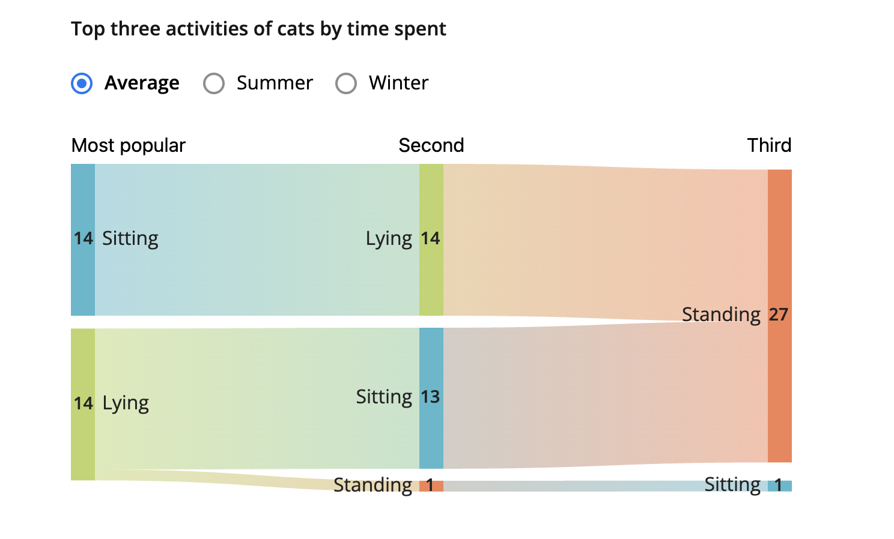
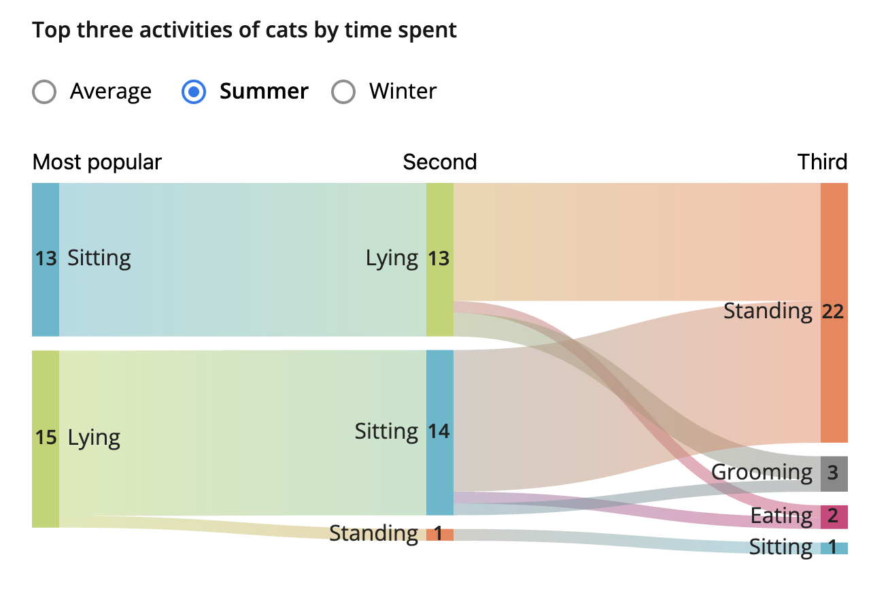
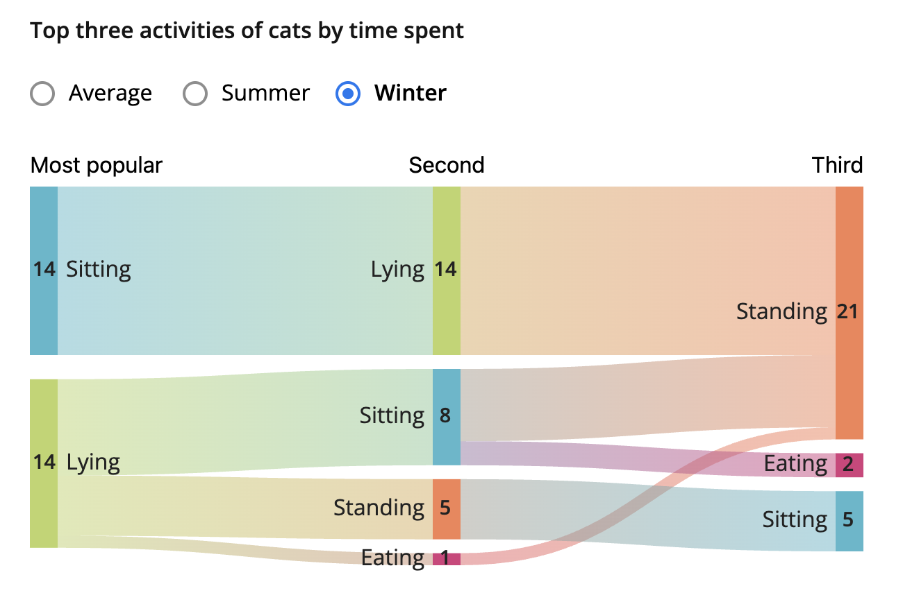
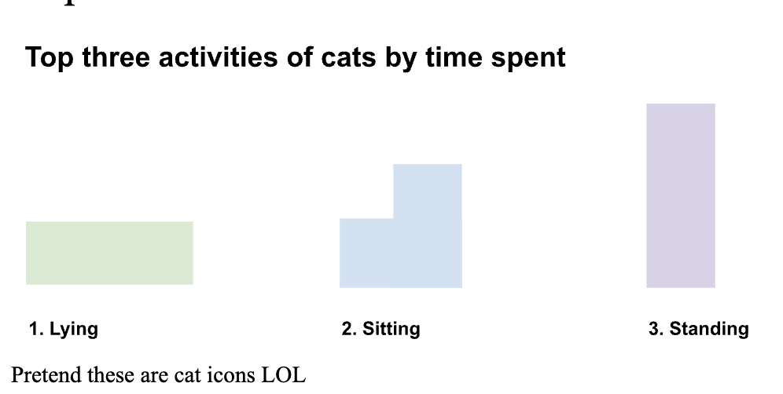

| [Home Page](https://cmustudent.github.io/tswd-portfolio-templates/) | [data viz examples](dataviz-examples) | [Are Cats Lazy?](critique-by-design) | [final project I](final-project-part-one) | [final project II](final-project-part-two) | [final project III](final-project-part-three) |

# Are Cats Lazy?
I love cats. They are fluffy beautiful balls of cutness, and I will fight anyone who disagrees with me.

Anyways, for this assignment, I wanted to explore the activity patterns of cats, and luckily with MakeoverMonday, I found one that matched my love for cats.

## Step one: the visualization

Original Graphic Link: https://lazy-cats.netlify.app/ 

Datasource:
Smit, M., Corner-Thomas, R. A., Draganova, I., Andrews, C. J., & Thomas, D. G. (2024). How Lazy Are Pet Cats Really? Using Machine Learning and Accelerometry to Get a Glimpse into the Behaviour of Privately Owned Cats in Different Households. Sensors, 24(8), 2623. https://doi.org/10.3390/s24082623

There are 3 visualizations, and I decided to choose the second graphic, the ribbon chart, which aimed to rank the top three actions a cat does during the summer and winter. This graphic had three filters.

## Step two: the critique

Overall, the graphic does the job for the intended audience. It's silly, colorful - but not too colorful, and feels relatively complete. The graphic is also quite reliable and valid.

I chose this visualization because it took me a bit longer to understand what the graphic wanted to show me. Ribbon charts aim to show rank over time, and while the cat graphic does so, it leaves the viewers asking more questions.
  - How much time did rank number 1 take up?
  - For rank 2, were all the different activities taking up the same time, thus making them all rank 2?
  - Why is the ranking displayed this way?

What's interesting is that despite this graphic being difficult to interpret, it does make the overall article in which it was placed in more engaging. It has its own filter system which I really wanted to include in my redesign!

## Step three: Sketch a solution

The first thing I wanted to tackle was the ranking system. How should I display the rankings without confusing the viewers which action is truly ranked first.

I decided to create the data where the cats represent the activity and there are labels that explicitly rank the action.

Additionally, I kept true to the colors of the article, so it fit in that context.

However, I was trying to figure out a good way to present the different seasons and ages of the animal since those greatly affect the outcome of the different ratios.

## Step four: Test the solution

Questions that I asked: 

- Can you tell me what you think this is?

- Is there anything you find surprising or confusing?

- Is there anything you would change or do differently?

- Should I create separate graphics for the season? If yes, how?

Results: 

Male Student: Try a dual axis attribute where one of the marks is a bar chart while the other marks are shaped like cats.

MSPPM Student: The rectangle-cat-like graphics are cute; however, a viewer could misinterpret the cat sizes as a measure of time or rank. Maybe a bar chart may actually benefit the viewer more.

Student using the same dataset: Likes the idea of filtering the data somehow. Suggested that age and season could be filtered.

Professor: Try to utilize Tableau or Datawrapper for this assignment since we are trying to build on this skillset.

Synthesis: 

I learned that even though my test sketch was cute and eye-catching, it does not completely answer the question of "top three things that cats do based on time spent". Time is not measured, and the graphics I included to show the cat actions could be interpreted in a way that can be confusing.

I essentially needed to rethink how to showcase the dataset without confusing the audiences... and also make it cute! Cute is a bonus.

## Step five: build the solution

Final Solution!

<noscript></noscript><object class='tableauViz'  style='display:none;'><param name='host_url' value='https%3A%2F%2Fpublic.tableau.com%2F' /> <param name='embed_code_version' value='3' /> <param name='site_root' value='' /><param name='name' value='AreCatsLazy_17750095719010&#47;Dashboard1' /><param name='tabs' value='no' /><param name='toolbar' value='yes' /><param name='static_image' value='https:&#47;&#47;public.tableau.com&#47;static&#47;images&#47;Ar&#47;AreCatsLazy_17750095719010&#47;Dashboard1&#47;1.png' /> <param name='animate_transition' value='yes' /><param name='display_static_image' value='yes' /><param name='display_spinner' value='yes' /><param name='display_overlay' value='yes' /><param name='display_count' value='yes' /><param name='language' value='en-US' /><param name='filter' value='publish=yes' /></object>

I decided to try my hand at Tableau again. I wanted to see how I could translate multiple pieces of data and make them into sort of a nested bunch. I found through tableau they have a pivot field function, and that made the process of making this bar chart much easier for me!

At one point I wanted to try to do the dual axis method, so I could make it cute, but it ended up not working out. The shapes would be placed inconsistently relative to the bars. I decided to not to go the cute route from that point.

I also played around with the filtering functions, and I was able to put two filters and let them float on the graph without taking up so much space on the graphic. The finished product, I believe, both presents the data as it was previously intended but it also adds more information without overwhelming the viewer.

## References
Data Source: Smit, M., Corner-Thomas, R. A., Draganova, I., Andrews, C. J., & Thomas, D. G. (2024). How Lazy Are Pet Cats Really? Using Machine Learning and Accelerometry to Get a Glimpse into the Behaviour of Privately Owned Cats in Different Households. Sensors, 24(8), 2623. https://doi.org/10.3390/s24082623

Pivot Data from Columns to Rows. (n.d.). Retrieved April 1, 2026, from https://help.tableau.com/current/pro/desktop/en-us/pivot.htm

## AI acknowledgements
AI was not used in this assignment.

