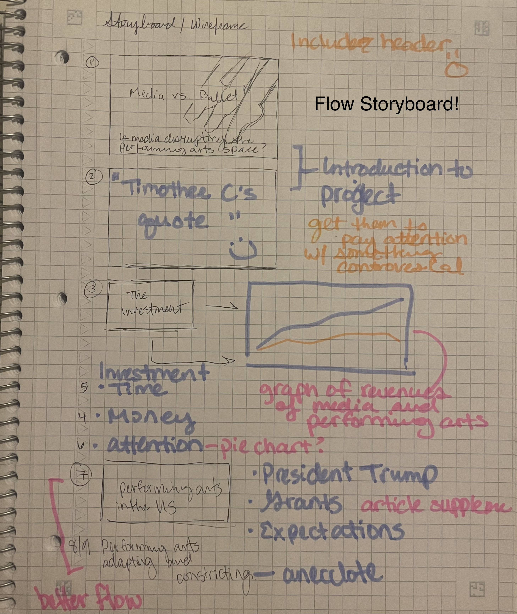

| [home page](https://cmustudent.github.io/tswd-portfolio-templates/) | [data viz examples](dataviz-examples) | [are cats lazy?](critique-by-design) | [final project I](final-project-part-one) | [final project II](final-project-part-two) | [final project III](final-project-part-three) |

# Wireframes / storyboards
Please note my entry in part 1 has been updated. Because there are some factors in this project that would be difficult to navigate (archival dataset not being readily available, major copyright hurdles, etc), I have decided to take a broader approach to my project. Instead of focusing on dance competitions and the entertainment space, I have decided to surround the project around Timothée Chalamet's quote. The goal of the project is to determine if his statement remains true, and what are the determining factors that are contributing to the disturbance of the performing arts space.

The project will have less focus on the competition space and more on ballet and performing arts in general being disrupted.

This is my final project Shorthand link once it gets published: (https://carnegiemellon.shorthandstories.com/54e0d82c-ac98-4676-aa09-ca59edc347dc/index.html)

My Storyboard Workflow Sketch:

The flow should be the following:
1. Title
2. Tim quote
3. The investment (Money, Time, Attention)
4. Performing Arts in the US
5. Performing Arts Adapting
6. Performing Arts Constricting
7. Call to Action
8. References

Some of my finalized chart sketches
Items that I am still missing:
- Graphics for wage data and hiring
- Graphics for consumption of entertainment (I had it then I lost it oops.)

# User research 

## Target audience 
My approach started off with a really broad overview of anyone who has watched a performing arts show or anyone that consumed content on a streaming platform or media. I've decided to narrow the target audience to the following attributes:
- Those in the United States or those who have interest in the United States in terms of entertainment
- Those who are fans of arts and entertainment, particularly those who are interested in ballet and dance as a whole
- Not Milennials and older: This is really important because in my research, those who attend ballets are on the older side. While I believe it is important to include everyone who is interested in the performing arts, I would only be preaching to the chorus if I choose to to have the older demographics as the target audiences. I want the younger generations to engage with my project.

To create this presentation that grabs my target audience, I wanted the following attributes to my project:
- Using almost like a film noir-esque theme with one or two colors to have my important information stand out
- Because of the decreasing attention span of the younger generation, making sure the information is both concise, informative, and entertaining
- Potentially using b-roll footage in one or two of my sections
- Ensuring the content is user friendly and the interface does not cause any issues

## Interview script

| Goal | Questions to Ask |
|------|------------------|
|   Discover the relationship between Media and performing arts.   |        Does media disrupt the performing arts?          |
|      |        Is media hurting or helping the performing arts?          |
|      |        Is my wireframe/storyboard shows that relationship at all? If not, where is the story not flowing?          |
|   Understand how much revenue the media gets versus the performing arts space gets.   |         How much do both sectors make?         |
|   Understand consumer behavior for seeing a performing arts show versus other forms of entertainment   |         Who are the consumers that go and watch the performing arts?         |
|      |        What are the different sectors of entertainment?          |

In general I wanted to focus on the flow of the presentation. I believe I have quite a bit of data to either support or detract from my findings, but I believe the flow is quite possibly the more difficult portion of this project.

## Interview findings

| Questions               | Interview 1 (briefly describe) | Interview 2 |
|-------------------------|--------------------------------|-------------|
| Do you understand the Shorthand framework so far? | Yes! But some areas seem abrupt            |  Yes! The transition between "The Investment" and "Performing Arts in the US" is abrupt.           |
| Do the charts make sense and support my arguement? (charts were shown individually)    |   Yes but maybe spread the data out more?   |  Yes agreed with interviewer 1  |
|  Do you think this theme and topic aligns with the target audience in mind?  |  Imagined gen z-ers who entered the dance scene because of tiktok        | Thought the color scheme was minimal but effective.   |

# Identified changes for Part III

The main changes I plan on implementing next week to address the issues identified are the following:

> Story flow and space 
It was stated in the interview that there is an abrupt flow in the project, particularly in the end. There is a lot of data in the middle of the project rather than spread out. I need to figure out a way to make the project flow a bit better. Perhaps some title sections or an image that gives the audience a breather. I was also thinking of incorporating my own anecdotal data to give the project more personality. I had such a big purpose in creating this project, so it would be good to sprinkle the background into the project.

> Shorthand Engagement

I'm still learning how to use Shorthand, so I need to figure out how I should use Shorthand to my advantage without overwhelming the viewers. If I add too many graphics, then the project will be slow and overwhelming. If I add not enough evidence, the target audience will be bored. I could learn how to do an "animation" of the chart like how the template did the line chart.

> Practice my 60-second pitch

To some degree, I have some sort of fear of public speaking. There is a 50/50 chance I will mess up my speech, and because there is only 60 seconds, there is no room for mistakes. My plan is to practice, practice practice. Not until perfect, but until permanent. I want to be able to not think while talking about my project. A potential method is to put myself where I was in middle school where I was pressured to do great in dance. This would set the tone of why I am doing this project.

# Final thoughts

I am still struggling to find detailed data that would not be super protected under copyright. This was the main reason why I updated my project scope. I believe the new direction for this project will assist in collecting public available data as well as having a more relatable story to grasp onto.

I'm really excited to see how my project will take form!

Random thought... I just noticed that data that I originally had access through for Statista is no longer accessible with the school license. I am not entirely sure what happened. Luckily I downloaded the data beforehand, but I need to look into my references and making sure they're being properly cited.

## References

Theater & Performance Arts. (n.d.). Statista. Retrieved April 18, 2026, from https://www.statista.com/outlook/amo/entertainment/theater-performance-arts/custom

Media. (n.d.). Statista. Retrieved April 18, 2026, from https://www.statista.com/outlook/amo/media/custom

## AI acknowledgements
_If you used AI to help you complete this assignment (within the parameters of the instruction and course guidelines), detail your use of AI for this assignment here._

